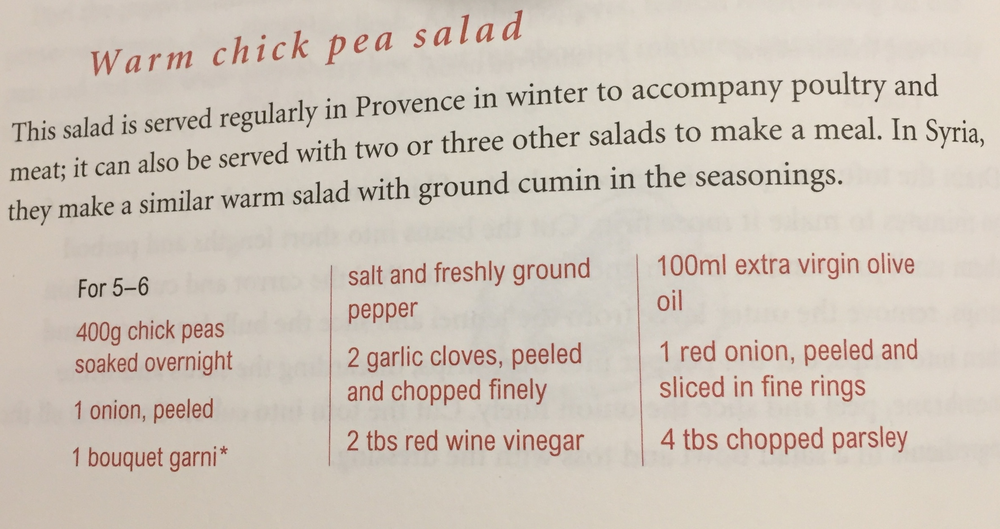

# ingreedy-js

How many carbs in that cookery book recipe? This app tells you!

## How to use it

Take a photo of the ingredient list from a recipe with your phone, and the app will calculate the
number of carbs in the recipe. It will also show a breakdown of carbs in each ingredient,
allowing you to see where the carbs are coming from.

You can edit the ingredient list after you scanned it in - this can be useful if
an ingredient is not recognized, or if you want to add or remove ingredients.

The app will try to detect the number of servings - but you can override that too.

## How it works

This project is an extension and follow on from my original Ingreedy project that I wrote
to make it easy to calculate carbs from recipes. The original Ingreedy has no OCR facility,
so you have to type in the ingredients list. It also allows you to save recipes, books, and
add new foods to the database.

Ingreedy-js is quicker to use, but less fully-featured, and is ideal to get a rough estimate of the carb count for a recipe.

The app is a web application written in HTML and Javascript. Apart from an API call to Google's Vision API,
the whole app runs locally in a browser on a phone or on a laptop.

### Image capture

The user takes a photo of a recipe, then it is displayed in the app. There is some code that fixes the orientation
of the image (see the [discussion here](https://medium.com/@ageitgey/the-dumb-reason-your-fancy-computer-vision-app-isnt-working-exif-orientation-73166c7d39da)).

### Image to text conversion

After the user has taken a photo, it is uploaded to Google's Vision API to convert it to text.
The Vision API returns a rich JSON representation of the document. A document is composed of
_blocks_, which are themselves broken into _paragraphs_, then _words_, then _symbols_.

This hierarchy allows us to use layout cues to help with finding and parsing information about
the recipe. The main goal is to find the list of ingredients from the photo, and ignore
extraneous information such as recipe directions, which tend to be in separate blocks.
We also want to find the number of servings that the recipe makes, which is often (but not always)
contained in a separate block to the ingredients.

#### Ingredient list detection

We cannot assume that all the blocks of text in the image are ingredient lists, since the user may
capture other recipe information like the name of the recipe, a description of the recipe,
or the directions for making the recipe.

The current implementation uses the heuristic that the ingredients list is contained in the block
in the centre of the image. This is simple, and works most of the time, especially if users know they
should point the camera so it's centred on the ingredients. However, sometimes it is impossible to 
do this, because the ingredients are spread across different panels:



There may also be separate ingredients lists for different components of a recipe (e.g. for a cake and its icing).
For these cases the best workaround at present is to take separate photos and add up the carb counts manually.

In the future, it would be nice to investigate an improvement that either uses a heuristic to find
blocks that contain ingredients (one possibility would be to look for lines that start with a number,
but some recipes have numbered lists for their directions), or a machine learning procedure to classify blocks
as "ingredient list" or "not ingredient list". Another alternative would be to allow the use to select the blocks
to include.

#### Servings detection

Many recipes include text like "Serves 4" to indicate the number of servings it will make.
We use a simple regular expression and look for matches in all the blocks in the document.
If a range is found, like "Serves 4-6", then we choose the lower end of the range (4 in this case) so that the
carb count errs on the large side. The user can override the number of servings anyway, which is also needed if
no matches are found for the regular expression (in which case we default to a single serving).

This could be improved by making the regular expression more general (if we find other common ways of specifying
the number of servings). Machine learning would work too, but might be overkill for this task.

### Ingredient parsing

When a block of text has been found that contains a list of ingredients, the next task is to parse each ingredient
line and calculate its carb count.

The first thing you realise once you start trying to parse ingredients lines is their sheer variety, which makes it
difficult to write a good parser from scratch. While it may be possible to get a long way using
rule-based approaches, a lot of work is required to construct a set of rules that works in almost all cases.

Fortunately, there is some prior work that we can take advantage of. The New York Times released
[code and data](https://github.com/nytimes/ingredient-phrase-tagger)
from their cooking web site for parsing ingredient lines. Their approach uses conditional random fields (CRF)
for extracting the quantity, unit, food, and comments from a line, trained on 170 thousand lines. You can read more
about how it works in this excellent [blog post](https://open.blogs.nytimes.com/2015/04/09/extracting-structured-data-from-recipes-using-conditional-random-fields/?_r=0).

A major challenge in using their CRF implementation is getting it working in a browser. The CRF implementation they use,
CRF++, is written in C++, and there don't seem to be any pure Javascript implementations. This is addressed by using
Emscripten to compile CRF++ into Webassembly so it can be run in the browser. (There are notes below for how this is done.)

#### Food identification

Once a food string has been found in a ingredients line, we need to find its nutrient data. There are many food nutrient
databases available, but the hard part is mapping a (possibly ambiguous) food name to an entry in the database.

For example, a recipes might specify just "flour", but without extra context it's hard to know that this should probably
match "Flour, wheat, white, plain, soft" and not, say, "Flour, rice".

To solve this problem we construct a _food map_ from names to food entries. The food map is constructed by taking the
NYT ingredient dataset, extracting all of the unique food names, and manually mapping them to food entries in a database.
In practice, we restricted to a dataset where each food name appeared at least 10 times. This gave a dataset of 1080
food names, which was not too onerous to manually go through to produce mappings. We used the UK
[Composition of foods integrated dataset (CoFID)](https://www.gov.uk/government/publications/composition-of-foods-integrated-dataset-cofid).

In practice, not all foods appear in the food map, since there is a long tail of very unusual foods. To address this,
we use text search against the food database. The intuition is as follows: if the food appears in the long tail then it is rare
and is likely to have only a single entry in the database. Even if there is more than one entry, they are unlikely to
be very different nutritionally. We use [lunr](https://lunrjs.com/) for the Javascript search implementation.

The current implementation doesn't consider text from the comments (as found by CRF), which means it can miss important distinctions
like "raw" versus "cooked". Curating a good food database is something that needs more work too, since there are always
some foods that don't appear in a particular database. Allowing users to add foods is an option here.

#### Measure interpretation

Now we have identified the food and its nutrients (and carbs in particular), but we are not done, since we need to
determine the quantity used in the recipe. Most of the time this is very straightforward, since we are given a quantity
like "500" and a unit like "grams" so we know that's 500g of the ingredient. But there are many other units from the very
specific ("tsp") to to vague ("handful"). Sometimes a recipe just specifies a number of a certain foodstuff, as in
"5 onions", so we need a database of typical weights for common foods.

The current implementation uses a small set of rules to interpret measures. Both to map units to weights (e.g. it knows
a teaspoon is 5g), and to store common food weights (e.g. it knows an onion is typically 130g).

#### A complication: split lines

It's worth noting that some ingredients lines are split over two or more
lines, which can complicate matters in some cases. For example, we would like to treat the following as a single line:

```
100g tamarind paste (the paste should
  be the consistency of a ketchup)
```

In the current implementation these two lines are treated one, since we
interpret the indent as a line continuation. Sometimes however there are no indentation hints:

```
100ml extra virgin olive
oil
```

The first line might be interpreted as "olive" rather than "olive oil", which could result in inaccurate carb counts.
This is quite a difficult problem and it may not be possible to get it right all the time (a possible cue we could use in this case is spacing between lines), so a simple workaround of
editing the text after scanning is worth recommending to users.

### Carb counting

For each ingredient line, we can now calculate the number of carbs since we know the food entry (and hence 
the number of carbohydrates in 100g) and the weight needed in the recipe. If any of these things are not known (because
we couldn't identify the food, the quantity, or the unit) then that line is marked as "unknown".

The total number of carbs is simply the sum of the carbs for each line. If there are any unknown lines then this is
flagged up in the total so the user knows it may not be complete. Unknown lines are marked with red question marks and a hint saying what the problem was,
which allows the user to edit the line so it can be re-parsed.

### User interface

The user interface is a basic HTML application that has been built without using any Javascript frameworks.

One challenge is to make it as easy as possible to compare the original ingredient line, with the OCR'd line, and with
the parsed line (quantity/unit/food). On the web this is straightforward, but on a mobile device it is much harder
since the horizontal space is very limited. Arguably, the scanned image can be hidden since the original source (the
cookery book) is in front of the user, but even doing two-way line comparision is tricky. There is a lot of scope
for improvement here.

## Developer notes

### How to run

Run a local server with

```bash
python -m http.server 8080
```

Then go to http://localhost:8080/demo.html in a browser.

### How to build

You will need [Node.js](https://nodejs.org/).

Then install the dependencies with

```bash
npm install
```

Build the bundle with

```bash
browserify index.js --standalone ingreedy > bundle.js
```

Run the tests with

```bash
npm test
```

### Building CRF++ with Emscripten

Install Emscripten: https://github.com/emscripten-core/emsdk

```bash
git clone https://github.com/emscripten-core/emsdk.git
cd emsdk
./emsdk update
./emsdk install latest
./emsdk activate latest
source ./emsdk_env.sh
cd ..
```

Download CRF++ source tar.gz: https://taku910.github.io/crfpp/#source

```bash
tar zxf CRF++-0.58.tar.gz
```

Build

```bash
cd CRF++-0.58/
emconfigure ./configure
emmake make
cp .libs/crf_learn .libs/crf_learn.bc
emcc .libs/crf_learn.bc .libs/libcrfpp.dylib -o crf_learn.js
cp .libs/crf_test .libs/crf_test.bc
emcc .libs/crf_test.bc .libs/libcrfpp.dylib -o crf_test.js

#
emcc .libs/crf_test.bc .libs/libcrfpp.dylib -o crf_test.html --preload-file ../model/model_file@model_file --preload-file ../ing.txt@ing.txt -s ALLOW_MEMORY_GROWTH=1 -s ENVIRONMENT=web --emrun
emrun --browser chrome crf_test.html -v 1 -m model_file ing.txt
emrun --browser chrome crf_test.html -v 1 -m model_file -

emcc .libs/crf_test.bc .libs/libcrfpp.dylib -o crf_test.html --preload-file ../model/model_file@model_file --preload-file ../ing.txt@ing.txt -s TOTAL_MEMORY=512MB -s ENVIRONMENT=web --no-heap-copy
python ../server.py # fixes wasm mimetype
# open http://localhost:8080/crf_test.html


# Bundle the model file (doesn't work yet)
#emcc .libs/crf_test.bc .libs/libcrfpp.dylib -o crf_test.js --preload-file ../model/model_file@model_file

```

Run

```bash
node crf_learn.js --help
node crf_test.js --help
```

Compile for use in node:

```bash
emcc .libs/crf_test.bc .libs/libcrfpp.dylib -o crf_test_node.js --embed-file ../model/model_file@model_file --embed-file ../ing.txt@ing.txt -s ENVIRONMENT=node
node crf_test_node.js -v 1 -m model_file ing.txt

emcc .libs/crf_test.bc .libs/libcrfpp.dylib -o crf_test_node.js --embed-file ../model/model_file@model_file --embed-file ../ing.txt@ing.txt -s ENVIRONMENT=node -s MODULARIZE=1 -s 'EXPORT_NAME="MyCode"' -s INVOKE_RUN=0 -s EXPORT_ALL=1
node crf_test_node_program.js
```